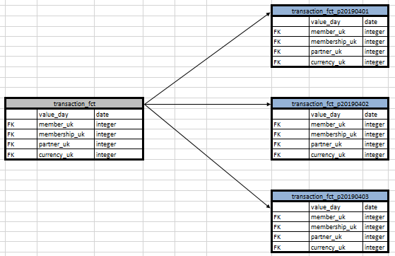
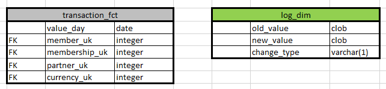
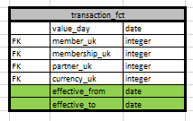

# Daily upload with historical data

```
So, depending on the amount of data, I can offer several strategies for data flow.
```

***
Partitioning
====

A large amount of data is loaded daily and you need to store everything. You can store them in different table partitions divided by date range.
With this strategy, daily data will always be in the data warehouse and it will be possible to analyze their changes over time.



***
Log entity
====

If you need to store only the changes and the current data snapshot, then you can load the data incrementally (merge). And the changes are stored in the log table with the fields old_value, new_value, change_type (U / D).
With such a strategy there will be an entity with current data without historical changes and an entity with only changes.



***
Historical entity
====

If the data volume is several rows, then it is possible to collect a history of changes within one entity. To do this, add date fields that define the period in which this data was true.
With this strategy, there will be only one entity, and the reports will be built on the basis of the required period of data reliability.



***